The following is a set of assembly instructions for the Thorlabs set up. This is the same for all lasers, the only changes are the laser, adaptor plate and filters needed.

If you want to change the focal distances based on your set up (which depends on how far the mouse is from the lens), the larger of the focal distance lens combinations (see paper, under Hardware design) should be the objective lens to keep the magnification at 0.5x.
You can also change the length of the rods for your needs, and how close you want pieces coupled together.

| Step | Instruction | Visual Aid |
| ---- | ----------- | ---------- |
|   1  | Attach the laser to the adaptor plate with screws (check the hole size in CAD).| 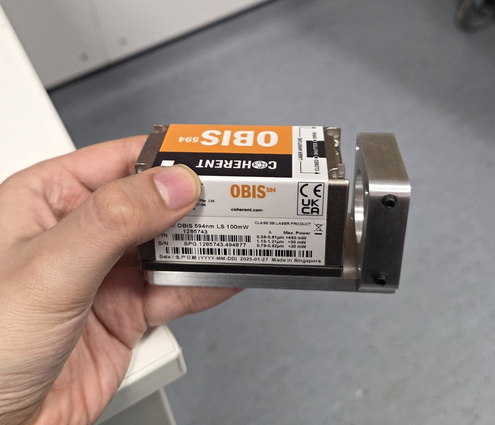|
|  2   | Carefully place a silver mirror (PFR10-03-P01) in a right angled mirror holder (KC1B/M) by loosening the black side screw to make room for the silver mirror insertion (reflective side facing inwards), and then tighten to lock it into place.| |
|  3   | Screw in cage rods (ER05) into the same KC1B/M part above in order to connect the laser adapter plate to the right angled mirror holder. Check the side holes in the CAD model to see which size screws you need for securing the ER rods into the custom adaptor plate.|  |
|  4   | Screw in ER05 rods into the other side of the KC1B/M part.| |
|  5   | Attach a lens tube (SM1L03) to couplers (SM1T010) on one side.| |
|  6   | Screw in one side of the lens tube into the threading ring (SM2A6) screwed into the large end of the galvos.| |
|  7   | Screw in ER05 rods into the galvo housing.| 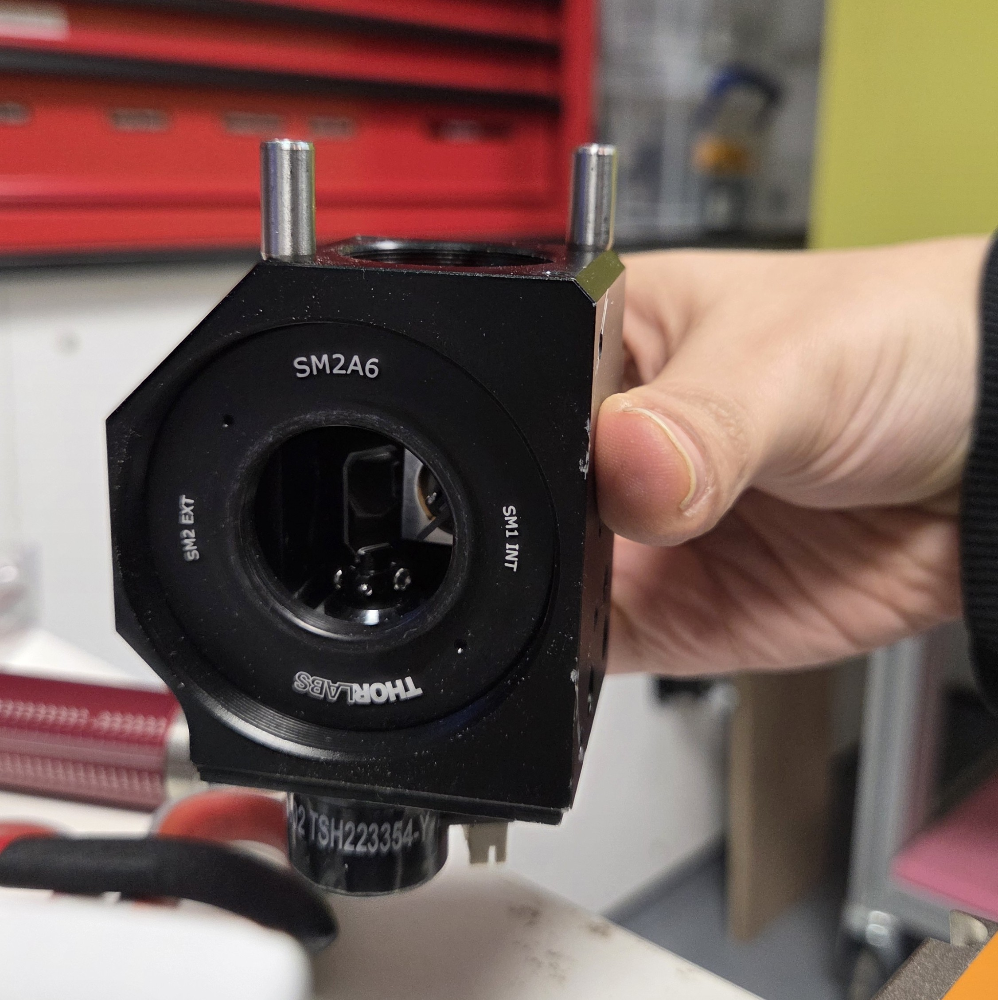|
|  8   | Connect the KC1B/M and the galvo housing with a cage plate inserting the rods in the holes of the cage plate (CP33T/M), and tighten the rods into place with the side screws.| 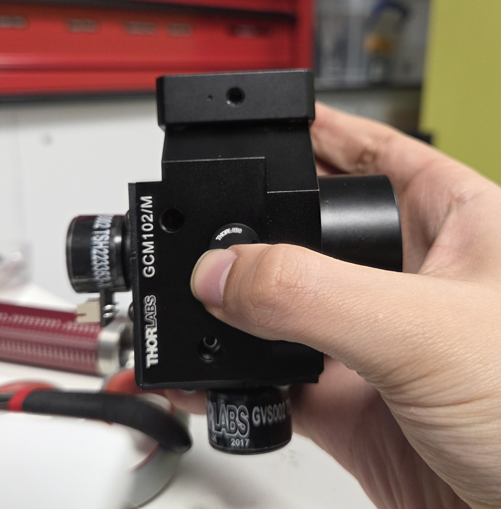|
|  9   | Insert your dichroic filter into the cage cube (CM1-DCH/M). There are small black screws to take out the base of the cage cube that has pinchable parts which move the clamp for the mirrors outwards. Gently place the dichroic filter in the correct orientation (the one that reflects more light should end up facing the galvos) after pinching to make room for the mirror, and release after properly placed. Screw the base plate back into the rest of the cage cube.|  |
|  10  | Attach another lens tube (SM1L03) into the side of the cage cube where the reflective part would face the galvos. Snap on a cap (SM1EC2B) on the other side of the cage cube to prevent light escaping.| |
|  11  | Take a lens tube (SM1L10), and remove one threading ring with an SM1 lens tool. Insert two lens (the set with the larger focal distance) carefully with the SM1 lens tube, with the convex (curved) sides of each lens touching each other. The depth at which the lens should be depends on the lens combination used and the distance this should be from the tube lens, which is all ultimately dependent on the distance the setup will be from your mouse. Put the threading ring back in.| |
|  10  | Attach another lens tube (SM1L03) into the side of the cage cube where the reflective part would face the galvos. Snap on a cap (SM1EC2B) on the other side of the cage cube to prevent light escaping.| |
|  11  | Take a lens tube (SM1L10), and remove one threading ring with an SM1 lens tool. Insert two lens (the set with the larger focal distance) carefully with the SM1 lens tube, with the convex (curved) sides of each lens touching each other. The depth at which the lens should be depends on the lens combination used and the distance this should be from the tube lens. Put the threading ring back in.| |
|  12  | Screw in the lens tube (SM1L10) to the side of the cage cube where the light would be redirected to (i.e.:the light reflects off the dichroic filter and goes downwards at a 90 degree angle).| |
|  13  | Remove the threading ring of a cage plate (CP33T/M) and put in the emission filter with the more reflective side facing the dichroic filter (i.e.: faces down, towards the incoming light). | 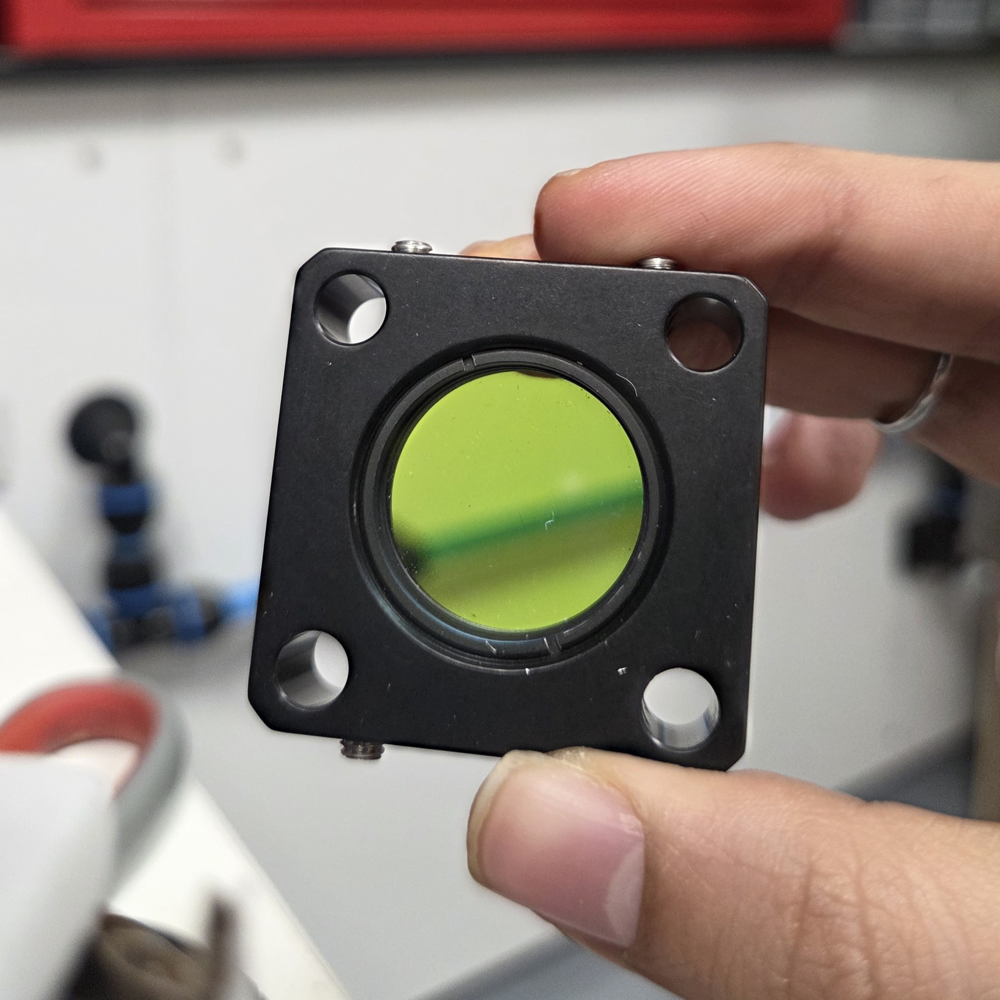|
|  14  | Screw in ER025 rods into the top of the cage cube with the dichroic and then secure this cage plate, with the filter facing downwards. | 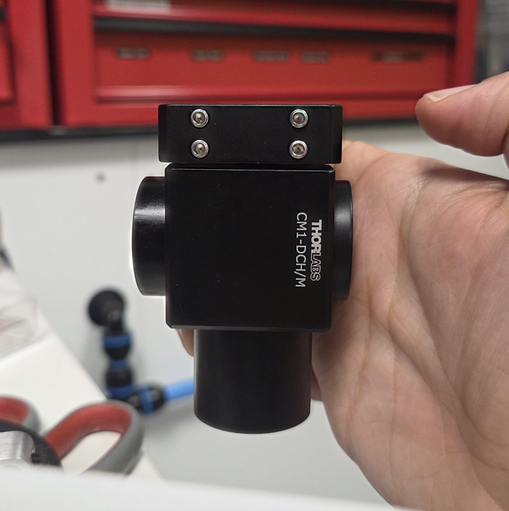|
|  15  | Insert the two lenses for the tube lens into another SM1L10. | 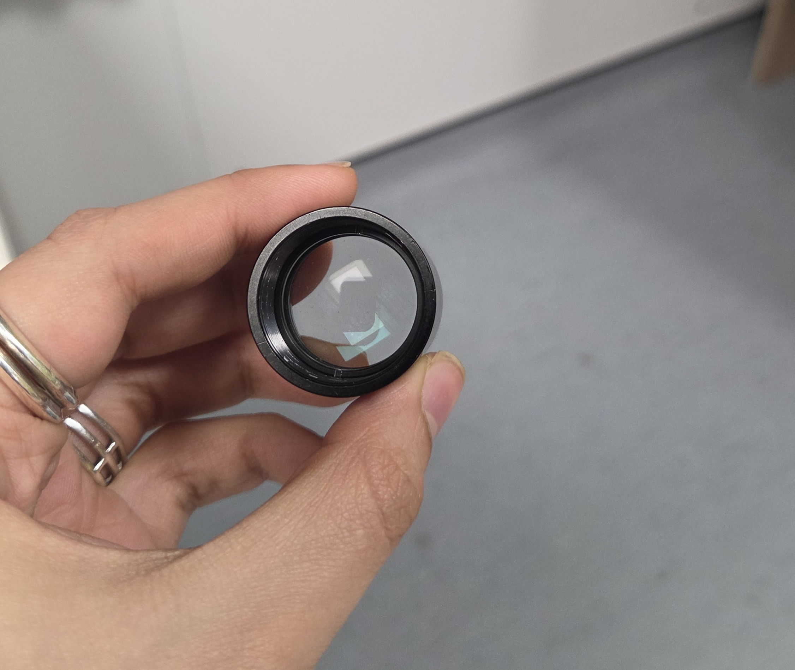|
|  16  | Screw this tube lens into one side of the cage cube mounted silver mirror (CCM1-P01/M). | |
|  17  | Screw in a C-mount coupler (SM1A9) and SM1 coupler (SM1T1O) to the Basler camera. | 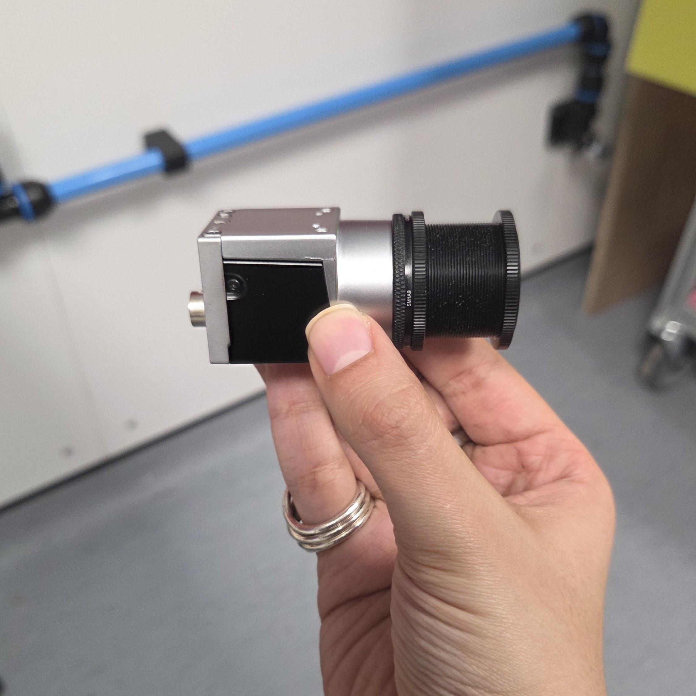|
|  18  | Screw in a lens tube (SM1L05) to the coupler. | 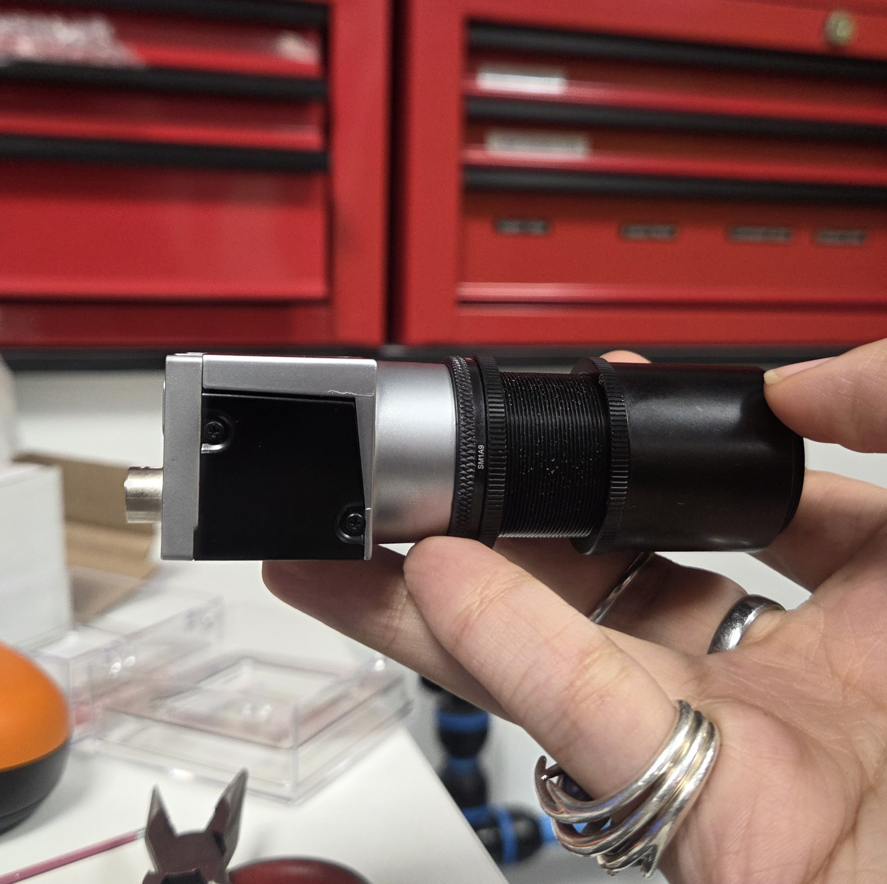|
|  19  | Screw in a coupler (SM1CPL10) to the lens tube. | 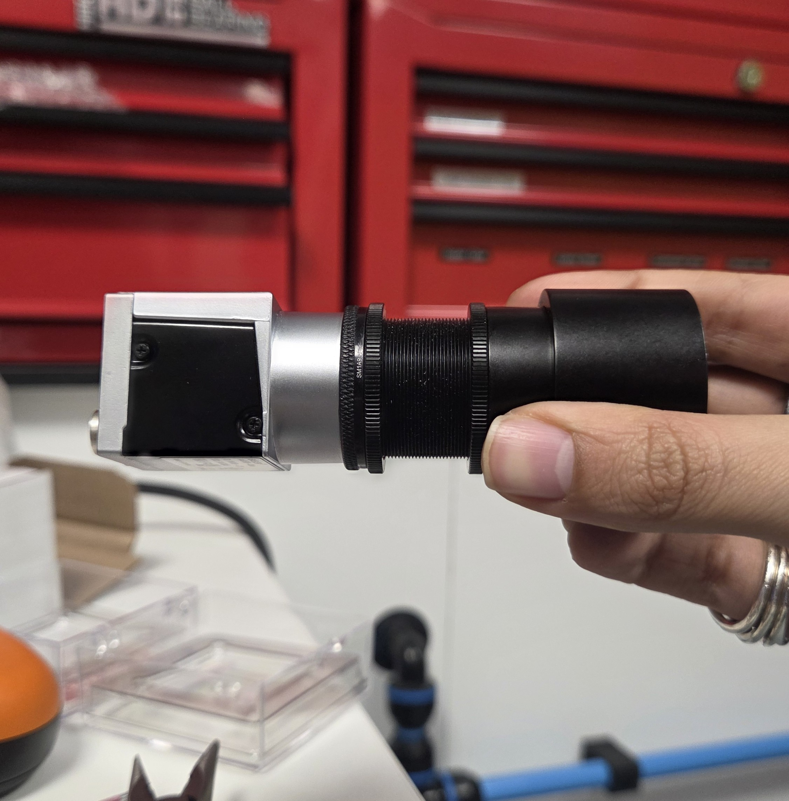|
|  20  | Connect the CCM1-P01/M with the tube lens to the other side of the coupler, and then connect ER025 rods to the other side of the CCM1-P01/M to secure the rest in place by the cage plate holding the emission filter. | 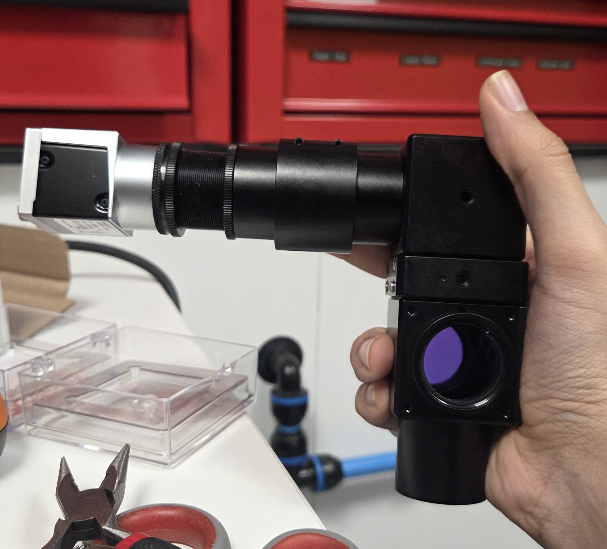|
|  21  | Connect the exposed end of the cage cube holding the dichroic to the galvos via another SM1T10 coupler. | 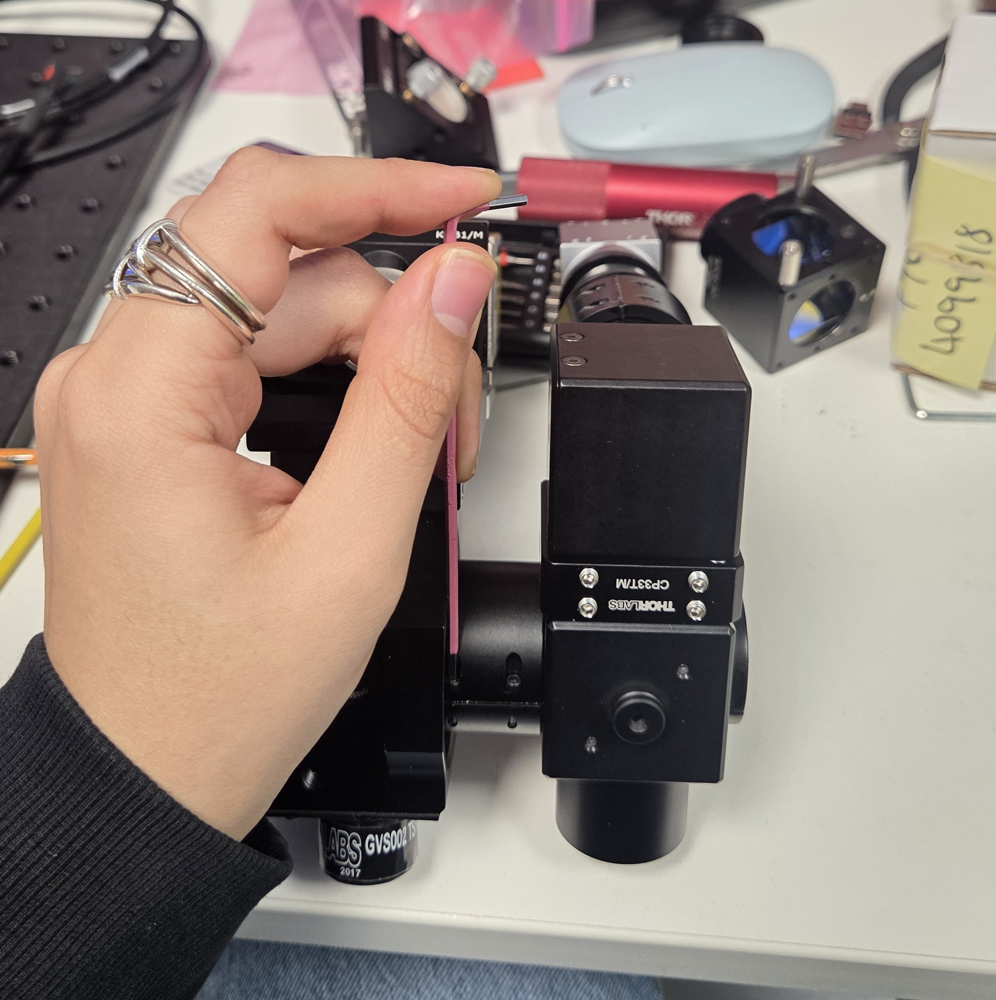|
|  22  | Mount to your set-up as desired.| |

Please get in touch if anything is unclear or you have an issue!
